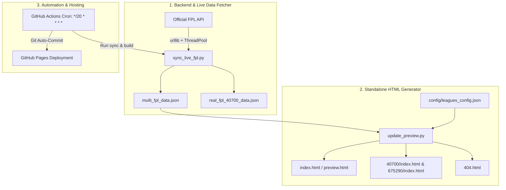

# FPL Mini-League Presentation Dashboard: Project Context & Architecture

> **เอกสารสรุปบริบทโปรเจกต์ (Project Blueprint & Single Source of Context)**
> บันทึกสถานะปัจจุบัน โครงสร้างระบบ สถาปัตยกรรม และประวัติการพัฒนาจากทุกแชท เพื่อให้ AI และผู้พัฒนาในทุก Session เข้าใจภาพรวมได้ทันที 100%

---

## 📌 1. ภาพรวมโปรเจกต์ (Project Overview)
โปรเจกต์นี้เป็น **Fantasy Premier League (FPL) Mini-League Presentation & Analytics Dashboard** ที่ออกแบบมาเพื่อแฟนตาซีมินิลีก (ฤดูกาล 2026/27) นำเสนอข้อมูลแบบ Real-time Live & Historical พร้อมระบบคำนวณเงินรางวัล, Hall of Fame, ผังผู้เล่น 11 ตัวจริง (Authentic Pitch), และระบบบทวิเคราะห์แชมป์ประจำสัปดาห์สไตล์ **"บอ.บู๋" (Borbou Commentary Engine)**

* **Production URL:** `https://asawamanasak.github.io/fpl-mini/`
* **Direct League URLs:**
  * ลีก 40700 (เซียนอยู่รู หมูอยู่ตึก): `https://asawamanasak.github.io/fpl-mini/40700`
  * ลีก 675290 (NudNee): `https://asawamanasak.github.io/fpl-mini/675290`
  * ลีก 38491 (รอ แมน โอน): `https://asawamanasak.github.io/fpl-mini/38491`
* **Repository:** `https://github.com/asawamanasak/fpl-mini`

---

## 🏗️ 2. สถาปัตยกรรมระบบ (System Architecture)

ระบบแบ่งออกเป็น 3 เลเยอร์หลัก:



---

## 📁 3. โครงสร้างไฟล์ในโปรเจกต์ (File Directory Map)

```
/Users/micky/Desktop/FPL เซียนอยู่รู/
├── .github/
│   └── workflows/
│       └── fpl_auto_sync.yml     # GitHub Actions รัน Auto-Sync ทุก 20 นาที
├── config/
│   └── leagues_config.json       # ไฟล์ตั้งค่ามินิลีก (ID, ชื่อลีก, กติการางวัล)
├── fonts/
│   ├── SukhumvitSet-Bold.ttf
│   ├── SukhumvitSet-Medium.ttf
│   ├── SukhumvitSet-SemiBold.ttf
│   └── SukhumvitSet-Text.ttf     # ฟอนต์พรีเมียม Sukhumvit Set ภาษาไทย
├── images/
│   └── fpl-logo.jpg              # โลโก้ FPL ประจำหัวเว็บ
├── js/ (Modular Core for Local Dev)
│   ├── api.js                   # API Fetcher & Fallback Proxy
│   ├── app.js                   # App Controller
│   ├── calculator.js            # สูตรคำนวณแต้มสุทธิ (หัก Hits), สถิติ Hall of Fame
│   ├── config.js                # ค่าคอนฟิกลีก 40700
│   ├── mockData.js              # ข้อมูลออฟไลน์สำรอง
│   ├── share.js                 # ฟังก์ชันคัดลอกสรุปผลส่ง LINE
│   ├── taglines.js              # เครื่องมือสร้างคำคมแชมป์
│   └── ui.js                    # UI Rendering Engine
├── css/
│   └── styles.css               # สไตล์ CSS และสนามฟุตบอล
├── 40700/index.html             # Entrypoint ตรงสำหรับลีก 40700
├── 675290/index.html            # Entrypoint ตรงสำหรับลีก 675290
├── 38491/index.html             # Entrypoint ตรงสำหรับลีก 38491
├── 404.html                     # รองรับ Single-Page Routing บน GitHub Pages
├── index.html                   # หน้า Dashboard หลัก (Standalone Bundle)
├── preview.html                 # หน้า Preview ในเครื่อง
├── multi_fpl_data.json          # ไฟล์ข้อมูลรวมทุกมินิลีก (Data Hub)
├── real_fpl_40700_data.json     # ไฟล์ข้อมูลย้อนหลังเฉพาะลีก 40700
├── sync_live_fpl.py             # สคริปต์ Python ดึงข้อมูลสดจาก Official FPL API
├── update_preview.py            # สคริปต์คอมไพล์ Standalone HTML ทุกมินิลีก
├── PROJECT_CONTEXT.md           # [ไฟล์นี้] สรุปพิมพ์เขียวโปรเจกต์ทั้งหมด
└── README.md                    # เอกสารแนะนำและกติกา
```

---

## ⚙️ 4. รายละเอียดมินิลีกและกติกา (League Rules & Configs)

ข้อมูลถูกควบคุมผ่าน `config/leagues_config.json`:

### ลีก 1: 40700 - "เซียนอยู่รู หมูอยู่ตึก"
* **สมาชิก:** 12 ทีม
* **งบประมาณรางวัลรวม:** **22,000 บาท**
* **โครงสร้างรางวัล:**
  1. **แชมป์ประจำสัปดาห์ (Weekly Champ):** 350 บาท x 38 สัปดาห์ = 13,300 บาท
  2. **แชมป์ฟุตบอลถ้วย (Cup Tournament):** แชมป์ 1,000 บาท / รองแชมป์ 650 บาท = 1,650 บาท
  3. **แชมป์คะแนนรวมฤดูกาล (Season Overall):** อันดับ 1 (3,500 บ.), อันดับ 2 (2,000 บ.), อันดับ 3 (1,000 บ.), อันดับ 4 (550 บ.) = 7,050 บาท
* **รอบเคลียร์เงิน 6 Phase:**
  * Phase 1 (GW 1-6), Phase 2 (GW 7-12), Phase 3 (GW 13-18), Phase 4 (GW 19-24), Phase 5 (GW 25-30), Phase 6 (GW 31-38 + บอลถ้วย + แชมป์ลีก)

### ลีก 2: 675290 - "NudNee"
* **สมาชิก:** 50 ทีม
* **โครงสร้างรางวัล:** 
  * รางวัลประจำเดือน 10 เดือน (ส.ค. - พ.ค.) เดือนละ 500 บาท รวม 5,000 บาท
  * รางวัลแชมป์คะแนนรวมประจำฤดูกาล (3-5 รางวัล ตามยอดเงินกองกลาง)
  * ส่วนเกิน 17,000 บาท: บริจาค รพ. 50% และสมทบรางวัลฤดูกาล 50%

### ลีก 3: 38491 - "รอ แมน โอน"
* **สมาชิก:** 15 ทีม
* **ค่าสมัคร:** 1,900 บาท/ทีม (50 บาท x 38 สัปดาห์)
* **งบประมาณรางวัลรวม:** **28,500 บาท**
* **การบริหารกองกลาง:** เก็บงวดเดียวเต็มจำนวน 1,900 บาท/ทีม โดยมี "เฟม" (Some might say) เป็นผู้ประสานงานและดูแลเงินกองกลาง
* **โครงสร้างรางวัล:**
  1. **แชมป์ประจำสัปดาห์ (Weekly Champ):** 500 บาท x 38 สัปดาห์ = 19,000 บาท (หักแต้มย้าย Hits, หากแต้มเท่ากันหารรางวัลเท่ากัน)
  2. **แชมป์คะแนนรวมฤดูกาล (Season Overall):** รวม 9,500 บาท
     * อันดับ 1: 4,500 บาท
     * อันดับ 2: 2,500 บาท
     * อันดับ 3: 1,000 บาท
     * อันดับ 4 - 5: อันดับละ 500 บาท
  3. **แชมป์ลีคคัพ (Mini-League Cup):** 1,000 บาท (เริ่มแข่งขันรอบ Knockout ใน Gameweek 35 เฉพาะทีมที่ชำระค่าสมัคร)

---

## 🎨 5. ไฮไลต์ฟีเจอร์สำคัญด้าน UI/UX & Frontend

1. **Standalone Single-File Distribution (`update_preview.py`):**
   - รวม HTML, Tailwind CSS (CDN), Chart.js (CDN), และ Multi-League Data JSON ไว้ในไฟล์เดียว
   - ตัดปัญหา CORS 100% รันได้ทันทีทั้ง Local (file://) และ GitHub Pages
2. **Authentic Pitch Formation & Official FPL Club Kits:**
   - ผังสนามฟุตบอล 4 ชั้น (GK, DEF, MID, FWD) พร้อมม้านั่งสำรอง
   - แสดงเสื้อแข่งจริงของสโมสร (Official FPL Kits) ทั้งเสื้อผู้เล่นเหย้าและเสื้อผู้รักษาประตู พร้อมเซฟเป็น Local Assets ใน `images/shirts/`
   - มี Badge แสดง Captain (C), Vice-Captain (V), และชิป (3xC, Bench Boost, Free Hit, Wildcard)
3. **Borbou Commentary Engine (ระบบวิเคราะห์สไตล์ บอ.บู๋):**
   - **กฎเหล็ก:** **งดใช้อีโมจิ 100%**, ใช้สำนวนดุดัน กวน ขยี้ ปากจัด แบบคอลัมนิสต์รุ่นเก๋า
   - **Century Club:** มีคำคมพิเศษเฉพาะสำหรับทีมที่ทำแต้มทะลุ 100+ คะแนนในสัปดาห์เดียว
   - **Customizable Note:** แอดมินสามารถพิมพ์แก้ไขบทวิเคราะห์สดได้บนหน้าเว็บ
4. **Instant LINE Copy:**
   - ปุ่มคัดลอกสรุปผลคะแนน ตารางอันดับ และเงินรางวัล เพื่อนำไปวางในกลุ่มแชท LINE ได้ทันที
5. **Visitor Counter Badge:**
   - แสดงยอดผู้เข้าชมเว็บไซต์แบบเรียลไทม์ที่ Footer ดีไซน์มินิมอลสีเทา `Visitors: xxxx`
   - เชื่อมต่อกับ `api.visitorbadge.io` แบบ Serverless พร้อมระบบ Cache บน `localStorage` ป้องกันหน้ากระตุก
   - **Anti-Spam / Cooldown Lock:** ล็อกคูลดาวน์ 1 ชั่วโมงต่อบราวเซอร์ ป้องกันยอดเฟ้อจากการกด Refresh (F5) หรือสลับแท็บไปมา

---

## 🔄 6. ระบบ Backend & GitHub Actions Sync

1. **สคริปต์ `sync_live_fpl.py`:**
   - ใช้ `ThreadPoolExecutor(max_workers=10)` ดึงข้อมูล Picks, Live Points, Sub, Captain ของทุกทีมพร้อมกัน
   - ดึงข้อมูลจาก:
     - `/api/bootstrap-static/` (รายชื่อนักเตะ, ทีม, สถานะ GW)
     - `/api/event/{gw}/live/` (แต้มสดและโบนัส BPS)
     - `/api/leagues-classic/{lid}/standings/` (ตารางอันดับลีก)
     - `/api/entry/{eid}/event/{gw}/picks/` (11 ตัวจริง, ตัวสำรอง, กัปตัน, Hits, ชิป)
   - คำนวณ Net Points = `Raw Points - Transfer Cost (Hits)` อย่างแม่นยำ
2. **การทำงานของ GitHub Actions Workflow (`fpl_auto_sync.yml`):**
   - Trigger: รันอัตโนมัติทุกๆ 20 นาที (`cron: '*/20 * * * *'`) หรือกดรันมือได้ (`workflow_dispatch`)
   - ขั้นตอน: Checkout -> Python 3.11 -> `python3 sync_live_fpl.py` -> `python3 update_preview.py` -> Auto Commit & Push `[skip ci]`

---

## 🔍 7. ปัญหาที่พบบ่อยและข้อสังเกตทางเทคนิค (Technical Insights)

### เรื่อง: สถานะ Gameweek แสดงเป็น `LIVE` แม้เตะจบครบทุกคู่แล้ว
* **สาเหตุ:** ทาง Official FPL Server ใช้เวลาประมาณ 8–18 ชั่วโมงหลังเกมนัดสุดท้ายจบ เพื่อรัน Batch ตรวจสอบข้อมูลระดับโลก (`data_checked`) ก่อนจะสลับค่า `finished: true` ใน `/api/bootstrap-static/`
* **แนวทางแก้ไขล่วงหน้า:** สามารถปรับให้ `sync_live_fpl.py` ตรวจสอบสถานะจาก `/api/fixtures/?event=X` หากทุกคู่ขึ้น `finished = true` หรือ `finished_provisional = true` ครบ 10 คู่ ให้ปรับ `is_finished = true` ให้อัตโนมัติทันที

### เรื่อง: การกดดูแผนจัดทีมเปิดไม่ติดในทีมที่มีเครื่องหมายคำพูด (Quote-Safety)
* **สาเหตุ:** ชื่อทีมที่มีเครื่องหมาย `'` เช่น `Ziang's Team` หรือ `Chatiwat's Team` ทำให้ inline `onclick` string attribute ถูกตัดสตริงและเกิด JS SyntaxError
* **แนวทางแก้ไขที่เสร็จสิ้น:** ปรับให้ส่งเฉพาะ `entry_id` (Number) เท่านั้น และค้นหาข้อมูลจาก JSON Object โดยตรง พร้อมเพิ่มการจัดการกรณีไม่มีข้อมูลแผนในสัปดาห์นั้นให้แสดงกล่องว่างแบบสวยงาม (Graceful Empty State) แทนการดึงข้อมูลทีมอื่นมาแสดง

---

## 🚀 8. แนวทางการพัฒนาต่อยอดในอนาคต (Roadmap)
1. **Smart Finished Detection:** ตรวจสอบจบ Gameweek ทันทีจากผล Fixtures
2. **Head-to-Head & Cup Bracket Visualization:** ผังสายการแข่งขันบอลถ้วยแบบอินเทอร์แอคทีฟ
3. **Player Transfer Analytics:** กราฟวิเคราะห์การซื้อขายตัวผู้เล่นรายสัปดาห์ (Transfers In/Out)
4. **Export as Image (Social Share Card):** แปลงตารางสรุปผลและผังสนามเป็นรูปภาพ PNG เพื่อแชร์ลงโซเชียลมีเดีย
